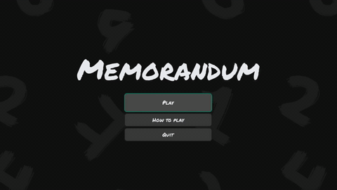
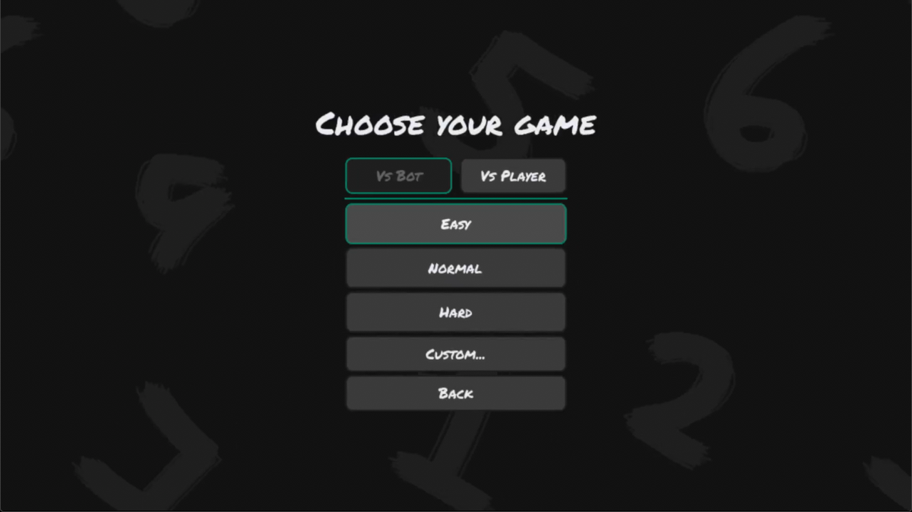
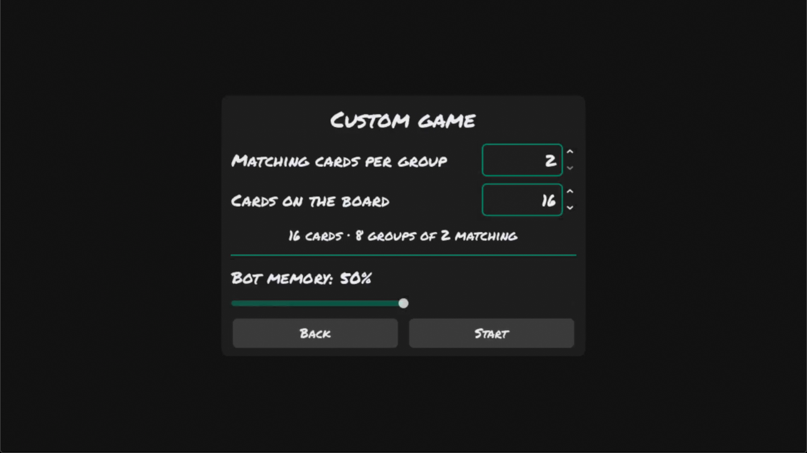
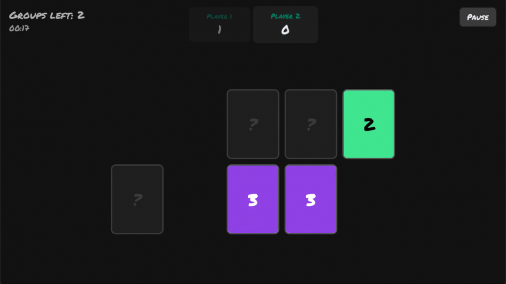

# Memorandum

A memory match game built with **Godot 4.7** (GDScript).

Flip cards, find the matching groups, and play against a bot with tunable
memory, against someone on the same keyboard, or against people in other
browsers.



## What it does

- **Groups of 2 to 5 cards**, not just pairs — a group only counts when every
  card in it is face up.
- **Four difficulties** (Easy, Normal, Hard, Nightmare) defined as `.tres`
  resources, editable straight from the inspector.
- **A bot with a probabilistic memory**: it forgets what it has seen according
  to a `bot_memory` value between 0 and 1, so "hard" means a better opponent
  rather than a bigger board.
- **Local play for two to four**, taking turns on the same device.
- **Online play for two to four**, in a browser or on the desktop: browse
  rooms, create one with an optional password, fill the empty seats with bots,
  and start.
- Sound effects, an animated shader background, a staggered UI intro and a
  shared theme.

|  |  |  |
|---|---|---|
|  |  |  |
| Pick an opponent and a difficulty | Or set the board up yourself | Two players, same keyboard |

## Running it

Open the project folder with Godot 4.7 or newer and press <kbd>F5</kbd>.
There is nothing to install and no plugins to enable. The main scene is
`scenes/main_menu/main_menu.tscn`.

Online play needs a relay to sit between the players, because a browser can
open connections but never accept them. One lives in `server/` — see
[server/deploy/README.md](server/deploy/README.md) to put it on a machine of
your own. `resources/net/` holds the addresses; the game ships pointing at the
public one.

## Architecture

Four layers, with dependencies pointing only downwards:

```
  4. SCREENS    scenes/     what you see and click
  3. ACTORS     players/    who makes the decisions
  2. CORE       core/       pure logic, zero nodes, testable
  1. SERVICES   autoloads/  things that survive a scene change

     NETWORK    net/        the wire, bolted on at the services layer
     RELAY      server/     a standalone Godot project, deployed on its own
```

The rules that hold it together:

- The **core** never mentions a node type, which is what makes it testable.
- **One coordinator** (`scenes/game/game.gd`) knows every other piece; nobody
  else knows more than its immediate neighbours.
- **Call downwards, emit upwards** — a child never reaches for its parent.
- **Single source of truth** — no state duplicated between model and view.
- **Base contract plus implementations** (`Player` → `HumanPlayer` /
  `BotPlayer`), so there is not a single `if is_bot:` in the project.
- **Configuration as data**, not code: the difficulties are `.tres` files, so
  balancing the game stopped being programming.

Online play adds one idea rather than a second code path. The relay is
**game-agnostic** — it knows peers, rooms and passwords, and forwards the rest
without looking inside, so the same binary serves any game whose clients agree
on a `game_id`. The client that created the room acts as **referee**: a click
only *asks*, and the turn loop advances for everyone on the referee's
confirmation. The game is deterministic given the deck, the config and the
sequence of picks, so every client runs the same `game.gd` and the entire
networked state of a match is a list of integers.

## Status

Everything playable is implemented, locally and online. Nothing is persisted
between runs yet — records and preferences are lost when the game closes.

Known limits of online play: the match ends if the referee closes the tab, and
a room can only be found in the public list, since there is nowhere to type a
room code yet.

## License

MIT. See [LICENSE](LICENSE).
